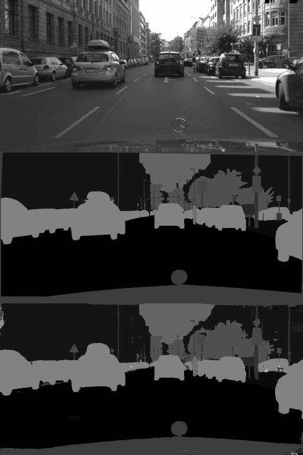

# CityScapes Segmentation
Train semantic segmentation on the cityscapes dataset


## Data
Unpack the separate parts of cityscapes into one directory. For instance...
```
.
├── gtFine
│   ├── test
│   ├── train
│   └── val
├── leftImg8bit
│   ├── test
│   ├── train
│   └── val
├── license.txt
└── README
```
See [this file](https://github.com/mcordts/cityscapesScripts/blob/master/cityscapesscripts/helpers/labels.py) for the label IDs.

Many of the cityscapes classes (trainId=255 or -1) are not used as per the instructions, so they are assigned trainId=19 which we call background.


## Usage
### dGPU:
Setup
```
virtualenv myvenv
source myvenv/bin/activate
pip install -r requirements.txt
```

Training the model. Checkpoints are saved every 5 epochs.
```
# Train the model.
python train.py -a train -p /path/to/cityscapes

# Train the model, restoring from a checkpoint
python train.py -a train -p /path/to/cityscapes -c /path/to/checkpoint.pth
```

Viewing outputs and evaluating.
```
# View outputs. Creates a folder called vis and writes to it
# Also creates `eval_result/` which can be passed to the official eval script.
python train.py -a vis -p /path/to/cityscapes -c /path/to/checkpoint.pth

pip install cityscapesscripts
CITYSCAPES_RESULTS="$(pwd)/eval_result/" CITYSCAPES_DATASET="$(pwd)/../cityscapes/" csEvalPixelLevelSemanticLabeling
```

Export an ONNX file for other inference APIs. Produces `cityscapes_resnet18.onnx`
```
# Export an onnx model
python train.py -a export -p /path/to/cityscapes
```

### Orin Nano Inference
Setup
```
sudo apt install nvidia-tensorrt-dev opencv-python

# Use --system-site-packages to pick up tensorrt from the system install.
virtualenv myvenv --system-site-packages
source myvenv/bin/activate

export PIP_INDEX_URL=http://jetson.webredirect.org/jp6/cu126
export PIP_TRUSTED_HOST=jetson.webredirect.org
pip install -r requirements.txt
```

Test
```
# First export onnx as described above, move the onnx file to Orin Nano

# To test compiled model...
# Sparsity will only be used if trained with APEX.
/usr/src/tensorrt/bin/trtexec --onnx=~/Downloads/cityscapes_resnet18.onnx --fp16 --saveEngine=cityscapes_trt.engine --sparsity=enable
python trt_infer_webcam.py
```


## Model
The default configuration is resnet18 with pretrained imagenet weights with some
upscaler blocks after to form a decoder back to the source resolution

The model can be replaced by anything that has the following in/out shapes.
* Input: `[B, 3, H, W]`
* Output: `[B, NUM_CATEGORIES, H, W]`

## Other
I originally used SGD with LR=1e-2, but my results improved drastically with AdamW and LR=5e-4
ffmpeg can make a video out of images like:
```
ffmpeg -framerate 30 -pattern_type glob -i '*.png' -c:v libx264 -pix_fmt yuv420p out.mp4
```
